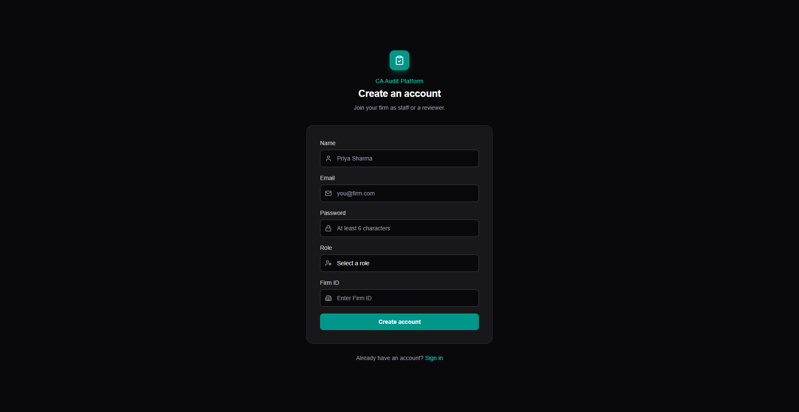
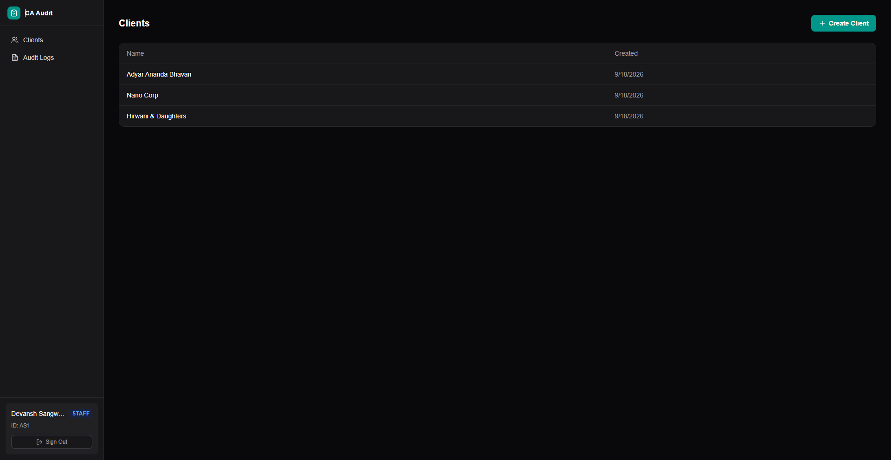
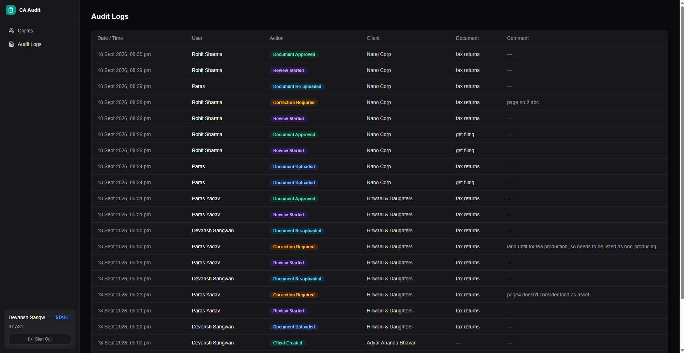
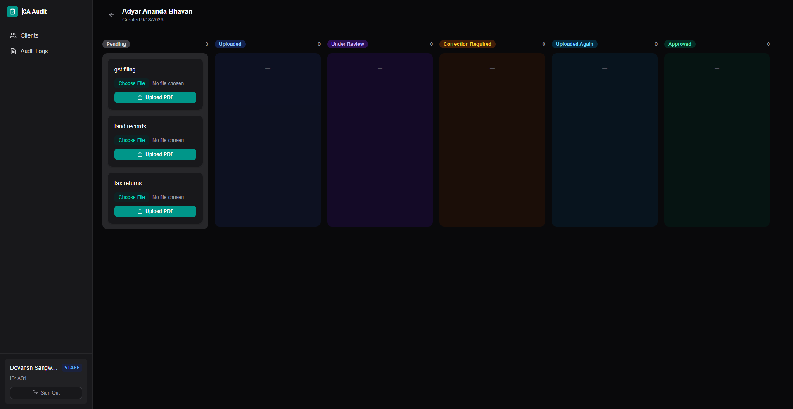
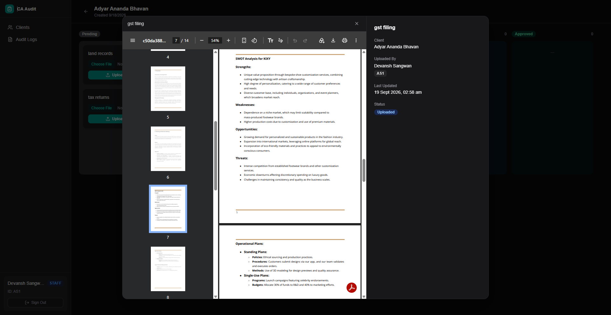
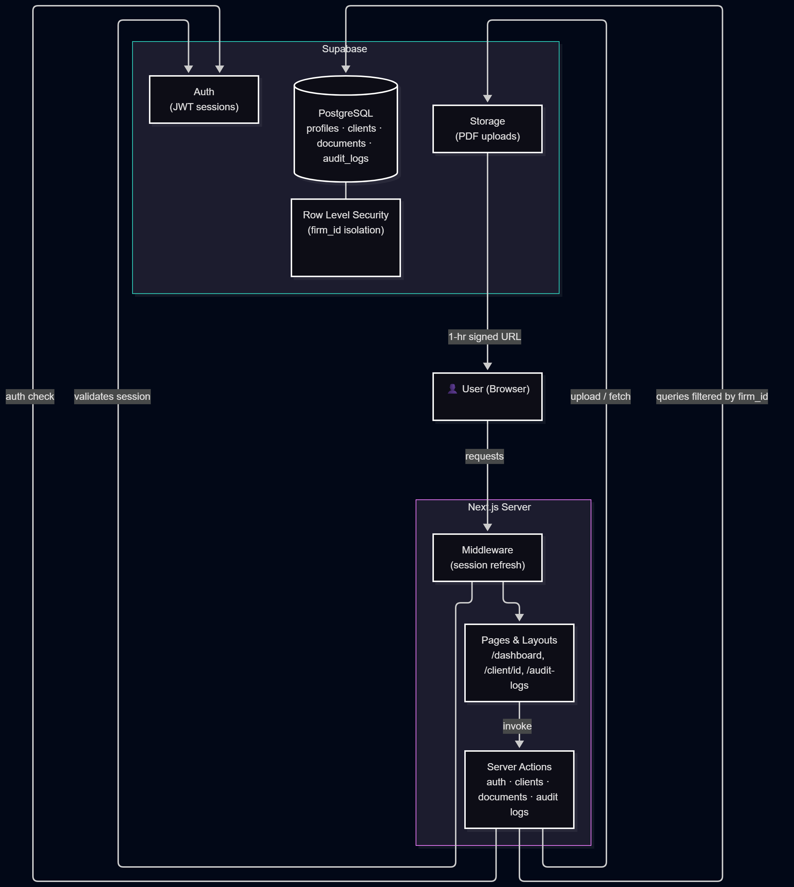

# Audit Workflow Platform for CA Firms

A full-stack, role-based document management and workflow platform designed for Chartered Accountant (CA) firms to streamline their audit processes and client management.


## ✨ Features

* **Role-Based Access Control (RBAC):** Distinct internal workflows for `STAFF` (uploading/managing documents) and `REVIEWER` (approving/rejecting documents).
* **Interactive Kanban Board:** Visually track document statuses across 6 stages (Pending, Uploaded, Under Review, Correction Required, Uploaded Again, Approved).
* **Secure Document Viewing:** Integrated PDF viewer that uses secure, short-lived signed URLs for data protection.
* **Client Isolation:** Staff and reviewers are restricted to viewing only the clients and documents specifically assigned to them.
* **Audit Logs:** Comprehensive tracking of all document state changes and user activities.

## 🛠️ Tech Stack

* **Frontend:** Next.js 15 (App Router), React, Tailwind CSS, TypeScript
* **Backend & Auth:** Supabase (PostgreSQL, Authentication, Row Level Security)
* **File Storage:** Supabase Storage (Secure Buckets)
* **Deployment:** Vercel

---

## Screenshots







## ❓ What would you improve with one more week?
With one more week, I would focus on adding an automated notification system. Currently, users have to manually check the dashboard to see if a document's status has updated. Sending quick email or in-app alerts when a file moves to "Correction Required" or "Approved" would speed up the review cycle and keep the team perfectly synchronized.

I would also build a simple analytics view for the firm administrators. Adding basic visual charts to track how many documents are currently pending, or measuring the average time it takes to complete a review, would give the firm valuable insights into where their workflow is slowing down.


## 🚀 Setup & Installation

### 1. Prerequisites
* [Node.js](https://nodejs.org/) v18 or higher
* npm, pnpm, or yarn
* A [Supabase](https://supabase.com/) account
* Git

### 2. Supabase Configuration (Backend)
Before running the application locally, you must configure your database and storage:
1. **Create a Project:** Start a new project in your Supabase dashboard.
2. **Authentication:** Enable Email/Password authentication in the Auth providers section.
3. **Database Schema:** Execute your SQL migrations in the Supabase SQL Editor to create the `profiles`, `clients`, `documents`, and `audit_logs` tables. Ensure Row Level Security (RLS) policies are active.
4. **Storage:** Navigate to **Storage** and create a new bucket named `audit-docs`. Apply necessary RLS policies to restrict uploads to authorized staff and reads to authorized project members.

### 3. Environment Setup
Clone the repository to your local machine:
```bash
git clone [https://github.com/your-username/your-repo.name.git](https://github.com/your-username/your-repo.name.git)
cd your-repo-name


